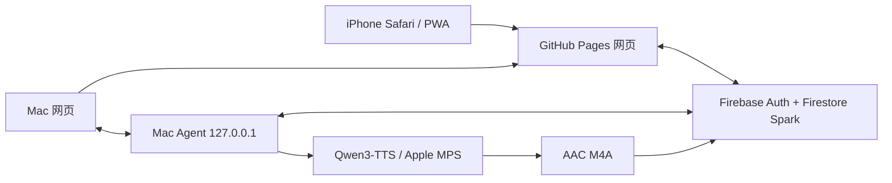

# 听见书页：本轮开发、部署与 iPhone 实测报告

报告日期：2026-07-18

项目版本：0.2.0 持续修复版

在线网页：<https://mkasumi1007.github.io/free-cross-device-audiobook/>

GitHub 仓库：<https://github.com/MKasumi1007/free-cross-device-audiobook>

## 1. 本轮目标

本轮工作把原来的命令行听书原型整理成一个可以在 Mac 和 iPhone 使用的网页听书系统：

- Mac 导入 EPUB/TXT，识别章节和正文；
- Mac 本地使用 Qwen3-TTS 与用户确认的声音样本生成音频；
- iPhone 在网页中同时阅读、听书和查看当前朗读段落；
- 已生成音频不依赖 Mac 在线，可以在手机播放；
- 登录后同步书架、书签和阅读进度；
- 未确认公开传播权的书、正文和音频使用 owner-only 私密路径；
- 全程只使用无需绑卡、不会自动扣费的免费方案。

本项目没有把“所有语音都放到免费云端 GPU 生成”作为已实现能力。当前真实架构是 Mac 本地生成，Firebase Spark 私密保存必要的压缩正文、时间线、音频和进度，GitHub Pages 托管网页。

## 2. 已完成的用户结果

- 网页书架可以显示多本书，手机和 Mac 使用同一账号同步书架元数据。
- 阅读器支持章节选择、正文显示、当前段高亮、播放/暂停、前后跳转、倍速、定时和书签界面。
- Google 登录按钮已在 iPhone 恢复，登录成功后显示头像和账号书架。
- 私密书籍正文已能在 iPhone 安全加载，不需要把书籍公开到 GitHub。
- 私密生成音频已能在 iPhone Safari 播放，并确认是用户自己的声音。
- iPhone 锁屏可显示书名、作者、封面、进度和播放控制。
- Safari 进入后台后音频继续播放，返回网页后播放器状态正常。
- 关闭或离开后返回，阅读/播放位置可以恢复；当前进度按 5 秒周期保存，因此允许约 0 至 5 秒误差。
- 章节标题修复后，不再把 `Section0001` 这类 EPUB 文件名优先显示成书内章节名。
- 章节已有部分音频时，点击章节会从该章第一个可播放段落开始，而不是停在尚未生成的第一段。
- 当前生成任务结束后可以自动安全更新 Mac Agent，不必让用户手动终止正在生成的内容。

## 3. 代码与架构清单

仓库中的可公开代码已包含：

| 目录 | 内容 |
| --- | --- |
| `apps/web` | React/TypeScript/PWA 书架、阅读器、播放器、登录、同步和系统状态 |
| `apps/mac-agent` | FastAPI loopback Agent、原生文件选择、诊断、配对与本地接口 |
| `services` | 任务领取、Qwen 调用、音频编码、私密资产同步与删除逻辑 |
| `packages/contracts` | Web、Agent 与云端共享的数据结构 |
| `packages/firebase-rules-tests` | Firestore 权限与租约规则测试 |
| `firebase` | Firestore Rules 与索引 |
| `installer` | 双击安装、更新、修复、卸载、模型自检和空闲更新脚本 |
| `scripts` | 免费能力审计、秘密扫描、基准和发布工具 |
| `tests` | Python 单元与集成回归测试 |
| `.github/workflows` | CI、Pages、Rules、清理和发布工作流 |

运行时分工：



GitHub Pages 和 Firebase 只负责网页、账号、私密同步与已生成内容读取。手机不连接 Mac 的本地端口，也不会在手机上运行 Qwen。

## 4. 本轮修复明细

### 4.1 iPhone 登录按钮

移动端页头曾隐藏账号操作，导致 iPhone 无法看到“登录同步”。现已增加独立移动端登录按钮和回归测试，未登录显示按钮，登录后显示头像。

对应提交：`1bb73b9 fix: restore mobile sign-in controls`

### 4.2 EPUB 占位章节名

部分 EPUB 的导航和 HTML 标题只有 `Section0001`、`chapter001` 等文件名。解析器现在会识别这类通用占位符，优先使用该章节第一条有意义的正文作为显示标题。已导入的旧书在重新加载本地书架时也会修复标题，不要求用户重新导入。

对应提交：`8b3d9c5 fix: replace placeholder epub chapter titles`

### 4.3 完整安装器和诊断代码归并

实际安装到 Mac 的 Agent 功能曾来自另一个本地开发分支。已把安装器、诊断、正式运行时和相关测试完整合并到公开主分支，避免“电脑里能用、GitHub 代码不完整”。

对应提交：`985e341 feat: ship macOS installer and diagnostics`

### 4.4 诊断失败不能阻断主功能

写诊断日志失败不再覆盖原始错误；非 macOS 或 CI 环境执行诊断时会安全降级，不会因为平台命令缺失导致整套测试失败。

对应提交：

- `df4d344 fix: keep diagnostics failures non-blocking`
- `02ec01a fix: degrade diagnostics safely off macOS`

### 4.5 私密正文自动刷新

Mac Agent 空闲时检查 owner-only 书籍的解析正文。如果本地内容发生变化，只上传新的压缩正文并更新指针，完成后清理旧副本；没有变化时不重复上传。原始 EPUB、TXT 和声音样本仍不上传。

对应提交：`bf04981 feat: refresh private book text while idle`

### 4.6 章节跳转到可播放位置

此前点击章节会固定选择章节第一段；当第一段尚未生成但后面已有音频时，手机会错误提示“本章没有音频”。现在会选择该章第一个已有 READY 音频覆盖的段落，没有音频时才退回第一段。

对应提交：`ba379ed fix: open chapters at available audio`

### 4.7 生成结束后安全更新

新增 `installer/update-agent-when-idle.sh`。脚本会等待 `active-task.lock` 释放并稳定一段时间，再只更新轻量 Agent runtime，不更新 Qwen 模型、不删除书、声音或检查点。脚本支持一次性 marker，避免登录后重复执行；不含用户名和个人绝对路径。

## 5. iPhone 真机实测

测试设备为真实 iPhone Safari，不以桌面浏览器的手机尺寸模拟代替。

| 测试项目 | 结果 | 证据说明 |
| --- | --- | --- |
| GitHub Pages 打开与移动布局 | 通过 | 书架、阅读器、底部播放器均正常显示 |
| Google 登录 | 通过 | “登录同步”可见，登录后显示用户头像 |
| 云端书架同步 | 通过 | 登录后显示私密书籍卡片 |
| 私密正文加载 | 通过 | owner-only 书籍正文在 iPhone 显示 |
| 私密音频播放 | 通过 | iPhone 可播放 Firestore 私密 M4A |
| 用户声音确认 | 通过 | 用户确认播放内容是自己的声音 |
| 当前段落高亮 | 通过 | 播放时正文高亮随音频变化 |
| 锁屏媒体信息 | 通过 | 显示书名、作者、封面和进度 |
| 锁屏播放控制 | 通过 | 播放、暂停和跳转按钮正常 |
| Safari 后台播放 | 通过 | 离开 Safari 后音频继续 |
| 返回 Safari | 通过 | 返回阅读器后状态正常 |
| 自动恢复位置 | 通过 | 暂停、离开再返回后恢复到保存位置 |
| 章节选择可播放段 | 代码修复，待真机复验 | 截图暴露问题后已修复并部署 |
| 添加到主屏幕 PWA | 未测试 | Safari 网页模式已通过，不等同 PWA 安装 |
| 倍速、定时、书签 | 未完成真机全覆盖 | 功能和自动化存在，仍需逐项真机操作 |
| 来电/耳机中断 | 未测试 | 需要真实通话或耳机事件 |
| Wi-Fi/蜂窝网络切换 | 未测试 | 需要真机网络切换 |

## 6. 测试与质量门禁

本轮功能修复完成后已执行：

```text
Python：87/87 通过；其中安装器定向测试 5/5 通过
Web 单元测试：22/22 通过
Firestore Rules Emulator：25/25 通过
Playwright desktop/mobile：8 个通过，2 个在可选公开 Release 资产不存在时跳过
TypeScript typecheck：通过
Ruff：通过
mypy strict：37 个源文件通过
Vite/PWA 生产构建：通过
免费能力审计：通过
秘密扫描：通过
Shell 语法与 git diff --check：通过
```

完整本地测试已在最终提交前重新运行；远端仍以本次提交触发的 GitHub Actions 为最终证据。

生产构建仍有一个非阻断提示：主 JavaScript 包约 969 KiB、gzip 后约 291 KiB，超过 Vite 默认 500 KiB 提示阈值。它不影响当前使用，但后续可通过路由/功能分包优化首次加载。

## 7. 部署与远端证据

功能提交 `ba379ed` 的 GitHub Actions：

- CI：<https://github.com/MKasumi1007/free-cross-device-audiobook/actions/runs/29643705269>
- Pages：<https://github.com/MKasumi1007/free-cross-device-audiobook/actions/runs/29643705273>

两个工作流均已通过。本文档和空闲更新脚本提交后会触发新一轮 CI 与 Pages，以最新 `main` 结果为最终状态。

## 8. 免费服务与费用边界

| 服务 | 用途 | 费用约束 |
| --- | --- | --- |
| GitHub 公开仓库 | 保存可公开代码和文档 | 免费，不存私密书籍/声音 |
| GitHub Pages | 托管静态 PWA | 免费 |
| GitHub Actions | 测试、构建、Pages 部署 | 使用公开仓库免费能力，不做长期 TTS |
| Firebase Authentication | Google 登录 | Spark 免费方案 |
| Firestore | 私密元数据、正文、音频、进度 | Spark 免费方案，应用设置保守硬限制 |
| 用户的 Mac | Qwen 语音生成 | 本机计算，不产生云 GPU 账单 |

项目禁止 Billing、Blaze、Firebase Storage、Functions、付费 GPU、按量对象存储、付费域名和需要银行卡的试用。达到保守免费额度时暂停，不自动升级。

## 9. 隐私与未上传内容

以下内容没有上传到 GitHub，也不应提交：

- 受版权限制的 EPUB/TXT 与解析正文；
- 用户的声音样本、试听音频和声音特征；
- 私密生成音频、时间线和本地检查点；
- Google/Firebase/GitHub token、Cookie、Keychain、验证码和会话；
- Firebase 私钥、API Secret、Access Token 和其他凭据；
- Qwen 模型缓存、运行日志和本机绝对路径；
- 任何能够直接登录或消耗账号额度的内容。

Firebase 网页配置中的 project ID、auth domain 等是公开客户端配置，不是管理员私钥；真正访问权限由登录身份和 Firestore Rules 控制。

## 10. 当前运行状态

编写报告时，Mac 正在继续一个已有语音生成任务。任务保留段级 WAV 检查点，不能为更新而强行终止。一次性空闲更新任务已安排：它会在生成锁释放后更新 Agent runtime，Qwen 模型和用户数据保持不变。

这项本机安排只包含运行操作，公开仓库中保存的是不含个人路径的通用实现。书籍名称、正文、声音、音频和本机日志不会随更新上传。

## 11. 仍需完成或复验

- 在 iPhone 刷新最新网页后，重新点击此前出现“没有音频”的章节，确认会跳到该章第一个可播放段落。
- 真机逐项测试倍速、定时停止和书签。
- 测试“添加到主屏幕”后的 PWA 启动与后台恢复。
- 测试来电、蓝牙耳机断连和系统音频中断。
- 测试 Wi-Fi 与蜂窝网络切换。
- 测试真实 Mac 物理重启后的自动恢复；目前已验证 LaunchAgent 重载和进程重启。
- 完整走一次“删除到期音频，再从保留位置重新生成”的真实用户流程。

这些未完成项不阻挡当前已生成私密音频在 iPhone 阅读和播放，但不能在完成前宣称已获得全场景验收。
