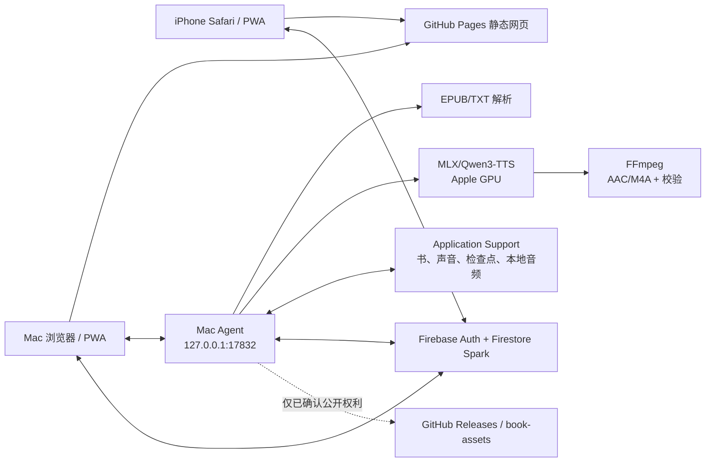

# 米兰读书项目交接文档

更新日期：2026-08-02  
当前正式版本：`0.5.3`  
正式基线：`main` / `e6c50bb` / `v0.5.3`

## 1. 交接结论

米兰读书已经具备可持续维护的完整主链路：Apple Silicon Mac 在本机使用用户确认的声音生成 AAC/M4A，电脑通过 loopback 立即播放；私密音频同步完成后，同一 Firebase 账号可在手机 Safari/PWA 收听。项目坚持免费路径，不使用付费云端 TTS、GPU、Firebase Blaze、Storage 或 Functions。

交接时的生产状态：

| 项目 | 状态 |
| --- | --- |
| GitHub 仓库 | <https://github.com/MKasumi1007/free-cross-device-audiobook> |
| 正式网页 | <https://mkasumi1007.github.io/free-cross-device-audiobook/> |
| 正式版本 | `0.5.3` |
| Release | <https://github.com/MKasumi1007/free-cross-device-audiobook/releases/tag/v0.5.3> |
| 安装包 | `MilanReader-Installer-0.5.3.zip` |
| Release 安装包 SHA-256 | `40b89c006b2ab08502cf819d227e008eabbdabc00dd4ca969e567d9e3a393b30` |
| Mac Agent | `0.5.3`，健康检查通过 |
| 后台 Worker | `IDLE`，无错误，无云端退避 |
| 最近本地同步验收 | 25 个本地音频块全部 `SYNCED`，待同步为 0 |
| 自动化 | Web 48、Firestore Rules 27、Python 123；正式 CI、Pages、安装器工作流均成功 |

上述“25 个音频块”只记录数量和同步结果，不记录用户身份、书名、正文、声音或资产标识。

## 2. 产品目标与明确边界

目标：

1. 在用户自己的 Mac 导入 EPUB/TXT。
2. 在 Mac 本地运行 Qwen3-TTS，并使用用户自己的参考声音。
3. 电脑和手机使用同一个网页阅读、管理队列和收听。
4. 书架、进度、任务和已同步私密音频跨设备可用。
5. 免费额度不足或网络中断时保留工作，不自动切换到付费服务。

非目标和硬边界：

- 手机不运行 TTS，也不能读取尚未同步的 Mac 本地文件。
- 未确认公开传播权的书籍永远不得进入公开 GitHub 资产。
- 声音样本和参考文字永远不上传。
- 不绑定银行卡，不启用 Firebase Blaze/Billing。
- GitHub Actions 只用于测试、构建和发布，不承担持续 TTS 计算。
- 当前正式安装器只支持 Apple Silicon macOS。

## 3. 系统架构



### 3.1 Web PWA

- 位置：`apps/web/`
- 技术：React 19、TypeScript、Vite、`vite-plugin-pwa`、Firebase Web SDK。
- 入口：`apps/web/src/App.tsx`。
- 主要组件：
  - `GenerationQueue.tsx`：跨书任务、排序、暂停、继续和移除。
  - `PlayerDock.tsx`：音频选择、私密/本机 Blob、时间线、倍速、书签和位置保存。
  - `AudioManager.tsx`：已生成音频和删除/重新准备。
  - `SystemStatus.tsx`：版本、Agent、模型、资源、Firebase 和 Worker 诊断。
  - `cloud.ts`：Firestore 数据访问和私密分片回读。
  - `agent.ts`：loopback Agent API。
  - `storage.ts`：IndexedDB 本地缓存。
- GitHub Pages 只托管应用外壳，不托管私密书籍和声音。

### 3.2 Mac Agent

- 位置：`apps/mac-agent/src/mac_agent/`
- 技术：Python 3.12、FastAPI、uvicorn。
- 入口：`main.py`。
- 关键模块：
  - `app.py`：loopback API。
  - `security.py`：Origin、Private Network Access 和 CSRF 防护。
  - `library.py` / `picker.py`：本机书籍和原生选择器。
  - `voice.py` / `preview.py`：声音选择、归一化、试听和确认。
  - `worker.py`：云任务、本地队列、资源保护、同步和保留策略。
  - `generation.py`：小段检查点、编码、发布回执和租约围栏。
  - `local_generation.py`：免费额度暂停时的本地持久队列和 loopback 资产。
  - `private_assets.py`：Firestore 私密资产分片上传。
  - `task_cloud.py`：任务领取、状态迁移、READY 记录和删除。
  - `diagnostics.py` / `error_reporting.py`：诊断和脱敏错误记录。

### 3.3 共享解析核心

- 位置：`services/audiobook-core/src/audiobook_core/`
- 负责 EPUB/TXT 解析、正文规范化、稳定 ID、章节模型和约 10 分钟音频块规划。
- Web 与 Agent 的数据契约位于 `packages/contracts/`。

### 3.4 Firebase

- 公开客户端配置：`config/firebase-public-config.json`。
- Firestore Rules：`firebase/firestore.rules`。
- 索引：`firebase/firestore.indexes.json`。
- Rules 测试：`packages/firebase-rules-tests/`。
- 只允许 owner 和当前有效配对 Worker 访问对应私密数据。
- Firebase Web 配置可以公开；登录 token、refresh token、Keychain 和 Firebase CLI 凭据不能公开。

## 4. 两条生成与播放路径

### 4.1 正常私密路径

1. Web 将用户选择写入 `generationRequests`。
2. 已配对 Agent 领取租约，状态依次进入 `LEASED → GENERATING → ENCODING → UPLOADING`。
3. Qwen 每次生成约 40 字的小段 WAV，并原子保存检查点。
4. 一个约 10 分钟块完成后，FFmpeg 合成 AAC/M4A 并完整解码校验。
5. 私密音频和时间线拆成 Firestore 小文档，SHA-256 验证完成后标记资产 `READY`。
6. Agent 在有效 `UPLOADING` 租约下写入 `audioChunks/READY`。
7. 手机以同一 owner 账号下载、校验并合并当前音频块，再创建临时 Blob URL 播放。

### 4.2 免费额度保护与本地回退

1. Firestore 返回 429 或达到应用保守阈值时，Worker 进入 `FREE_QUOTA_LOCAL_READY` 并逐步延长云端检查间隔。
2. 新任务进入 `LocalGenerationStore`，继续在 Mac 生成。
3. 本机网页通过 `LOCAL_MAC` loopback URL 读取，使用带正式 Origin 的 `fetch` 得到 Blob 后再交给 `<audio>`。
4. 云同步恢复后，Agent 直接复用已生成 M4A/时间线，不重新朗读。
5. 五小时远程音频容量限制只阻止生成更多云音频，不能阻止已有本地音频上传。
6. 本地记录只有在云端 `audioChunks/READY` 成功后才变成 `SYNCED`。

### 4.3 存储模式

| 模式 | 正文/时间线 | 音频 | 使用条件 |
| --- | --- | --- | --- |
| `LOCAL_MAC` | Mac 本地 | Mac 本地 | 免费额度暂停后的即时播放和待同步 |
| `PRIVATE_FIRESTORE` | owner-only Firestore | owner-only Firestore | 默认；未确认公开传播权 |
| `PUBLIC_GITHUB` | `book-assets` | GitHub Releases | 用户明确确认拥有公开传播/再分发权 |

`LOCAL_ONLY` 书籍只能使用 `LOCAL_MAC` 或 `PRIVATE_FIRESTORE`，发布器和流水线都会拒绝存储模式不匹配。

## 5. 状态机与关键不变量

云任务主要状态：

```text
QUEUED → LEASED → GENERATING → ENCODING → UPLOADING → READY
             ↘ PAUSED / FAILED_RETRYABLE
```

本地生成主要状态：

```text
QUEUED → GENERATING → ENCODING → UPLOADING → READY
READY + PENDING/FAILED → SYNCING → SYNCED
```

必须保持的不变量：

- 一次只运行一个生成任务和一个 Qwen 进程。
- `attempt_id + lease_token + lease_deadline + deletion_generation` 共同阻止旧任务发布。
- Firestore 只接受处于 `UPLOADING` 的有效任务发布 `READY` 音频。
- 音频、时间线和发布回执必须属于同一存储模式。
- 发布回执不可跨 `PUBLIC_GITHUB`、`PRIVATE_FIRESTORE`、`LOCAL_MAC` 复用。
- 本地 `READY` 记录如果缺文件，必须重新排队生成，不能向网页宣称可播放。
- 自动清理只能删除完成至少 120 小时的音频；书籍、声音、阅读进度和检查点不随音频自动删除。

## 6. 仓库结构

```text
apps/web/                         React/Vite PWA
apps/mac-agent/                   FastAPI、Worker、TTS 调度
services/audiobook-core/          EPUB/TXT 解析与领域模型
packages/contracts/               TypeScript 数据契约
packages/firebase-rules-tests/    Firestore Rules Emulator 测试
firebase/                         Rules 与索引
installer/                        安装、更新、修复、卸载、锁文件、Mac app
assets/branding/                  正式图标源文件和 icns
scripts/                          审计、测试、基准和发布探针
tests/                            Python 测试
docs/                             用户、维护、隐私、验收和交接文档
.github/workflows/                CI、Pages、安装器、受限 TTS 基准
```

本地生成的 `.local/`、`dist/`、虚拟环境、Node 依赖、模型、日志、书籍、声音和音频都由 `.gitignore` 排除。

## 7. 正式 Mac 运行环境

为兼容旧版数据，品牌虽为“米兰读书”，数据根仍是：

```text
~/Library/Application Support/听见书页/
├── agent-runtime/          轻量 Agent 环境
├── qwen-runtime/           旧 Qwen/PyTorch 环境
├── mlx-runtime/            当前默认 MLX TTS 环境
├── tools/                  托管 Python、uv、FFmpeg
├── models/                 Hugging Face 模型缓存
├── books/                  私密解析书籍
├── voices/                 私密声音、文字和试听
├── generation/             小段 WAV、检查点和发布回执
├── local-generation/       本地回退队列与 M4A
├── logs/                   私密日志
├── state/                  安装状态
└── installer/              更新/修复脚本
```

- Agent 只监听 `127.0.0.1:17832`。
- LaunchAgent 标识：`io.github.mkasumi1007.audiobook-mac-agent`。
- 默认 TTS：`mlx-community/Qwen3-TTS-12Hz-0.6B-Base-4bit`。
- 兼容 Qwen 模型：`Qwen/Qwen3-TTS-12Hz-0.6B-Base`。
- 不要移动或改名数据根；卸载脚本也不能递归删除整个数据根。

## 8. 开发环境与验证命令

要求：Node 22+、Python 3.12、Java 21（Firestore Emulator）、Apple Silicon Mac（真实 TTS/安装验收）。

```bash
python3 -m venv .venv
.venv/bin/pip install -e '.[dev]'
npm install

npm test
npm run test:e2e
npm run build
.venv/bin/ruff check .
.venv/bin/mypy services/audiobook-core/src apps/mac-agent/src
git diff --check
```

`npm test` 已串联：免费能力审计、秘密扫描、TypeScript、Web 单元测试、Firestore Rules Emulator 和 Python 测试。

真实 Mac 改动还必须验证：

1. `bash installer/build-installer.sh` 能生成 zip 和 checksum。
2. 新 Agent 通过 `/v1/health` 返回目标版本。
3. 至少生成一段真实中文 WAV/M4A，并由 FFmpeg 完整解码。
4. 临时离开源码目录后，LaunchAgent 仍能从 Application Support 运行。
5. 若改动私密同步，至少观察一个任务真实变为 `SYNCED`。

## 9. 日常诊断

健康检查必须携带允许的 Origin：

```bash
curl -fsS \
  -H 'Origin: https://mkasumi1007.github.io' \
  http://127.0.0.1:17832/v1/health

curl -fsS \
  -H 'Origin: https://mkasumi1007.github.io' \
  http://127.0.0.1:17832/v1/diagnostics

curl -fsS \
  -H 'Origin: https://mkasumi1007.github.io' \
  http://127.0.0.1:17832/v1/local-generation/status
```

主要日志：

```text
~/Library/Application Support/听见书页/logs/diagnostics.jsonl
~/Library/Application Support/听见书页/logs/agent.log
~/Library/Application Support/听见书页/logs/agent-error.log
~/Library/Application Support/听见书页/logs/mlx-stderr.log
~/Library/Application Support/听见书页/logs/install-*.log
```

日志可能包含本机路径、任务 ID 和异常栈，不能直接贴到公开 issue 或提交到 Git。

## 10. 安装、更新与回滚

普通更新入口：`~/Applications/米兰读书/更新米兰读书.app`。

安装器行为：

1. 固定 uv/Python 和依赖 lock。
2. 在 `*.next` 建立新运行时。
3. 运行导入、自检和健康检查。
4. 原子切换 current/previous。
5. LaunchAgent 启动失败时恢复 previous。
6. 成功后保留用户的书、声音、模型、检查点和本地音频。

开发机只更新 Agent 的命令：

```bash
bash installer/install.sh \
  --repair runtime \
  --skip-model-test \
  --source-root "$PWD"
```

这条命令只适用于维护者已经完成相关真实模型验证的快速 Agent 更新；正式首次安装不可跳过模型自检。

## 11. GitHub 工作流和发布流程

| 工作流 | 触发 | 作用 |
| --- | --- | --- |
| `CI` | PR、`main` push | 安全审计、依赖审计、类型、测试、E2E、构建 |
| `Deploy Pages` | `main` push | 构建并部署 PWA |
| `Build Mac installer` | `v*` tag、手动 | 在 macOS runner 生成安装器 artifact |
| `Bounded TTS benchmark` | 手动 | 只做有时限的技术基准，不用于生产 |

发布新版本时：

1. 更新所有版本号位置；用 `rg` 检查旧版本残留，但不要修改第三方依赖版本。
2. 更新 README、用户指南、验收证据和本交接文档。
3. 跑完整门禁和真实 Mac 验收。
4. 通过 PR 合并 `main`，确认 CI 与 Pages 成功。
5. 创建 `vX.Y.Z` tag。
6. 运行 `installer/build-installer.sh`，创建 Release 并上传 zip/checksum。
7. 从 Release 下载，校验 SHA-256 和 Gatekeeper 流程。
8. 更新正式 Mac，确认健康版本和 Worker 状态。

当前版本号至少存在于：

- `pyproject.toml`
- `package.json`
- `package-lock.json` 的根和 Web workspace 条目
- `apps/web/package.json`
- `apps/mac-agent/src/mac_agent/paths.py`
- `installer/install.sh`
- `installer/build-installer.sh`
- 四个 Mac app 的 `Info.plist`
- README、用户指南和测试 fixture

## 12. 安全、隐私和免费额度

绝对不能提交或输出：

- 真实 EPUB/TXT/PDF、解析正文和书名清单；
- 真实声音、参考文字、试听、M4A/WAV；
- OAuth/Firebase/GitHub token、Cookie、Keychain 内容；
- 日志、模型、缓存、开发机绝对用户路径；
- 私有资产 key、任务租约 token 和配对码。

免费设计：

- Firebase 只使用 Authentication 和 Firestore Spark。
- 应用保守停在每日 45,000 reads、18,000 writes、18,000 deletes。
- 私密单分片不超过 512 KiB，单逻辑资产不超过 32 MiB，总私密资产在 700 MiB 停止新增。
- 远程 READY 音频约五小时后停止生成更多；音频满五天由 Mac 执行普通删除。
- 429 后本地继续生成、云端降频；绝不自动开通付费能力。

修改 Rules 时，任何新增允许路径都要覆盖匿名、其他 owner、未配对 Worker、已撤销 Worker 和伪造租约。不要为了消除 403 放宽为 collection-group 通读。

## 13. 0.5.3 故障复盘

用户看到“目录显示可听，但播放器说无法读取；手机一直等待生成”。根因共有四层：

1. `<audio src>` 直接请求 loopback 时不带允许的 Origin，被 Agent 返回 403；改为 `fetch → Blob URL`。
2. 五小时容量检查发生在本地成品同步之前，导致缓存满后永远不上传；现在容量限制只阻止新生成。
3. 云端发布回执曾被本地发布器误复用，产生没有本地文件的假 `READY`；现在回执必须匹配存储模式，缺文件会自动恢复。
4. 本地成品上传时云任务未进入 `UPLOADING`，Firestore Rules 正确拒绝 `audioChunks/READY`；现在先经过 `ENCODING → UPLOADING` 再提交完成记录。

真实修复结果：缺失短音频自动补回，25 个本地块全部同步，Mac 播放器从 00:00 正常前进，Worker 回到 `IDLE`。相关回归测试位于 `PlayerDock.test.tsx`、`test_generation.py`、`test_local_generation.py` 和 `test_worker.py`。

2026-08-02 又定位到一个独立的网页播放器问题：点击章节后，旧的 `jumpRequest` 会在音频状态刷新时被重复处理，使 `audio.currentTime` 每隔数秒回到章节开头。现在播放器按请求 `key` 只消费一次，同一个任务快照刷新不会再次跳播；新的回归测试覆盖“同一请求不回零、新请求仍可跳转”。

## 14. 已验证与仍待验证

已验证：

- Apple Silicon MPS/MLX 本地中文生成和 FFmpeg M4A。
- 真实用户确认声音链路。
- Mac 安装、覆盖更新、LaunchAgent 重载和源码独立运行。
- Google 登录、Mac 配对、账号书架和私密正文。
- 私密音频 Mac → Firestore → Web 播放。
- 本地回退音频播放和恢复后的 25/25 云同步。
- iPhone Safari 播放、后台、锁屏控制和位置恢复的历史真机证据。

仍待完成或补证据：

1. 真实删除 → 保留 cursor → 重新生成的完整闭环。
2. iPhone 添加到主屏幕后的最新版本更新体验。
3. iPhone 倍速、睡眠定时、书签、来电/耳机中断和网络切换。
4. Mac 物理重启后的自动恢复；目前只验证 launchd 重载和进程重启。
5. 新用户从 Release 下载后的完整 Gatekeeper 首装。
6. `audioChunks` Rules 接近 Emulator 1,000 表达式上限，需要在不削弱权限的前提下重构。
7. iPhone 长章节连续播放和跨音频块自动续播仍需在最新 Pages 构建上完成最终真机复验。

## 15. 建议的后续优先级

1. **P0：删除/重新生成真机闭环。** 这是当前唯一尚未完成的核心数据生命周期。
2. **P0：iPhone 最新 Pages 刷新复验。** 确认所有已同步章节不再显示等待生成。
3. **P1：iPhone 长章节连续播放复验。** 覆盖前后台切换以及跨音频块自动续播。
4. **P1：Rules 复杂度重构。** 保持 owner、active worker、lease、private asset READY 和 deletion generation 五层屏障。
5. **P1：真实物理重启。** 记录开机后 Agent、队列、检查点和播放恢复。
6. **P2：签名/公证评估。** 会产生费用，只有用户明确同意后才能开始。

## 16. 新维护者第一天检查清单

- [ ] 阅读 README、本交接文档、`PRIVACY_AND_PUBLIC_DATA.md` 和 `MAINTENANCE.md`。
- [ ] 确认仓库 remote、默认分支、最新 tag 和 Release。
- [ ] 运行 `npm test`、`npm run test:e2e`、`npm run build`、Ruff 和 mypy。
- [ ] 打开正式网页，检查 Pages build 与 Agent 版本一致。
- [ ] 检查 `/v1/health`、`/v1/diagnostics` 和本地同步计数。
- [ ] 不打印 Keychain、token、声音、正文或私有资产内容。
- [ ] 任何付费能力、公开传播或破坏性数据清理都先取得用户明确授权。
- [ ] 修改同步/删除状态机前先增加失败路径测试，再做真实小样本验收。

## 17. 相关文档

- [普通用户指南](USER_GUIDE.md)
- [开发与发布维护手册](MAINTENANCE.md)
- [故障排查](TROUBLESHOOTING.md)
- [隐私、公开数据与权利边界](PRIVACY_AND_PUBLIC_DATA.md)
- [免费服务审计](FREE_SERVICES.md)
- [验收矩阵](ACCEPTANCE.md)
- [0.4.0 生成状态与断点续作](2026-07-30_生成状态与断点续作.md)
- [历史项目完整说明](项目完整说明.md)

本文件是 0.5.3 起的当前交接入口。历史文档保留当时证据，不应覆盖本文件记录的当前版本、正式链路和未完成项。
