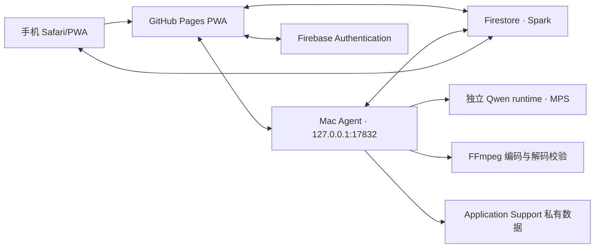

# 米兰读书：项目完整说明

> 本文是 0.2.0 阶段的历史完整说明。当前版本、运行状态、0.5.3 故障复盘、发布流程和后续优先级请以 [项目交接文档](PROJECT_HANDOVER.md) 为准。

文档版本：0.2.0

更新日期：2026-07-18

网页：<https://mkasumi1007.github.io/free-cross-device-audiobook/>

仓库：<https://github.com/MKasumi1007/free-cross-device-audiobook>

## 1. 项目目标

米兰读书让用户在自己的 Apple Silicon Mac 上导入 EPUB/TXT、用本机 Qwen3-TTS 和自己的参考声音生成音频，再通过同一个网页在 Mac 与手机阅读和收听。尚未生成的内容不能脱离 Mac 继续计算；已经上传完成的私密音频可以由同一 Firebase 账号读取。

用户可在 Mac 或手机的网页中跨书选择任意章节，形成持久化的“待生成列表”。列表支持调整顺序、暂停、继续和移除；正在生成的小段正常结束后才应用新安排。Mac 只按该列表工作，READY 音频达到约 5 小时后释放模型并等待，5 天到期音频清理后自动继续。

项目必须保持零付费路径：不绑银行卡、不启用 Blaze/Billing、不使用付费 GPU，不把 GitHub Actions 当长期 TTS 后台。接近保守免费阈值时暂停，而不是自动升级。

## 2. 证据状态

| 能力 | 当前证据 |
| --- | --- |
| EPUB/TXT 解析、章节、正文、稳定 ID | 已编码；单元测试通过；本机保留过真实 EPUB |
| React 书架、阅读器、播放器、音频管理 | 已编码；Web/Playwright 自动化覆盖 |
| Google 登录、Firestore 同步、Mac 配对 | 真实 iPhone 登录、头像、账号书架和私密正文回读通过 |
| 双击安装和登录自启 | 真实 Mac 首次安装、覆盖更新、服务重载、源码移除后重启通过 |
| Qwen/声音/WAV/M4A | 真实 MPS、真实已确认声音和 FFmpeg 验证通过 |
| 私密正文/音频 Firestore | Rules 25 个 Emulator 测试；真实 iPhone owner-only 正文与音频回读通过 |
| 手机尺寸与 PWA | 自动化通过 |
| 真实 iPhone Safari/锁屏/进度 | 播放、后台、锁屏控制和位置恢复通过；中断与网络切换待测 |

详细逐阶段证据见 [ACCEPTANCE.md](ACCEPTANCE.md)。任何没有对应证据的能力不得写成“已完成真实验收”。

## 3. 架构



### 3.1 Web

- React、TypeScript、Vite PWA，部署于 GitHub Pages。
- IndexedDB 保存书架缓存和本地进度；Firestore 保存账号元数据、任务、书签和同步进度。
- 只有 Mac 页面显示导入和本机诊断；手机不会读取 localhost Agent。
- 试听使用带 Origin 的 `fetch` 取得 Blob，不再让 `<audio>` 直接请求 loopback。
- “系统状态”检查网页/Pages build、Firebase、登录、Firestore、配对、Agent、运行时、模型、MPS、资源、Worker 与最近错误。

### 3.2 Mac Agent

- FastAPI 仅监听 loopback；Origin allowlist、Private Network Access 和 CSRF 保护写操作。
- 原生选择器负责书籍和声音，浏览器不能传任意文件路径。
- LaunchAgent 随登录启动，程序来自 Application Support 的独立环境。
- 后台 Worker 使用 Firebase 匿名身份和 macOS Keychain refresh token，按租约领取任务。
- 一次只运行一个 Qwen 进程；状态、attempt、token、deadline 和 deletion generation 共同围栏迟到结果。

### 3.3 Qwen 与音频

- Agent 和 Qwen 使用两个锁定环境，避免 torch 污染 Web 服务。
- 默认模型为 `Qwen/Qwen3-TTS-12Hz-0.6B-Base`。
- 优先 MPS；诊断会明确报告不可用，不能悄悄切到付费资源。
- 第三方 stdout 重定向到私有 stderr 日志，stdout 只传 JSON-lines 协议。
- 超过 120 字的原段落在 Qwen 子进程内按标点分片，再顺序写入同一个 WAV；播放器仍使用原段落 ID。
- 段级 WAV 是检查点；全部段完成后 FFmpeg 编码 AAC M4A，再完整解码音轨并通过 progress 输出验证时长。

### 3.4 Firebase 与 GitHub

- Firebase 只使用 Authentication 和 Firestore Spark。
- 私密资产拆成不超过 512 KiB 的部分，逻辑资产不超过 32 MiB，应用总量硬停在 700 MiB，并以 SHA-256 校验。
- `LOCAL_ONLY` 书不得获得公开 URL；Worker 必须通过 active link 才能读取其 owner 的必要元数据和私密资产。
- 只有用户明确确认公开再分发权时，正文/时间线才可进入 `book-assets`，音频才可进入 GitHub Releases。
- GitHub Actions 仅测试、构建、安装包和 Pages；CPU TTS 基准已证明不适合作为后台。

## 4. 正式安装与目录

用户从 Release 下载 zip 并双击安装器。首次 Gatekeeper 可能要求 Finder 右键“打开”，因为项目没有购买 Apple Developer 签名/公证。

安装器自动完成：

1. 校验并安装固定 uv 与托管 Python 3.12；
2. 从 hash lock 创建 `agent-runtime.next` 与 `qwen-runtime.next`；
3. 检测系统 FFmpeg，缺失时下载固定 Apple Silicon wheel，分别校验 wheel 与所提取二进制的 SHA-256；
4. 把 Hugging Face 模型放入正式模型目录；
5. 使用 MPS 真实生成中文 WAV、编码/探测 M4A；
6. 原子切换运行环境，注册/重载 LaunchAgent；
7. 目标版本健康检查通过后才删除 `.previous`。

```text
~/Library/Application Support/听见书页/
├── agent-runtime/       # 轻量 Agent
├── qwen-runtime/        # torch/qwen-tts/soundfile
├── tools/               # uv、Python、可选 FFmpeg
├── models/huggingface/  # 模型
├── books/               # 本地解析书籍
├── voices/              # 声音与试听
├── generation/          # 私有检查点
├── logs/                # 私有日志
└── state/               # 安装/模型自检状态
```

“听见书页”仅作为旧版兼容数据目录名保留，防止品牌改名后已有书架、声音、
音频和进度消失；网页、安装器和桌面应用统一显示“米兰读书”。

卸载只删除白名单运行组件，保留 books、voices、generation 与 models。完整用户步骤见 [USER_GUIDE.md](USER_GUIDE.md)。

## 5. 书籍权利与隐私

| 模式 | 正文/时间线 | 音频 | 公开性 |
| --- | --- | --- | --- |
| `LOCAL_ONLY` | owner-only Firestore | owner-only Firestore | 私密 |
| `PUBLIC_RIGHTS_CONFIRMED` | GitHub `book-assets` | GitHub Releases | 公开且不可撤回第三方副本 |

默认必须是 `LOCAL_ONLY`。原始书籍与声音不上传；私密正文只上传解析后的必要数据。书籍、声音、token、模型、日志和本机路径不得进入 Git。

## 6. 任务、恢复与删除

1. Web 创建任务，指定 owner、book、start cursor、voice version、storage mode 和 deletion generation。
2. 已配对 Worker 领取租约并周期续期；其他 Worker 或旧 attempt 不能发布。
3. 每个原段生成 WAV 后写入原子 checkpoint；重启复用 hash 匹配的 WAV。
4. M4A、时间线和私密 parts 全部验证后才写 READY。
5. 音频满 120 小时由在线 Mac 逐本扫描并进入两阶段删除；也可由用户提前请求。
6. 删除保留书、正文位置、进度、书签、声音和 start cursor；以后可以重新生成。

已知维护风险：`audioChunks` Rules 状态分支复杂，部分预期拒绝测试会触及 Emulator 1000 表达式上限。允许路径有测试，但后续应拆分规则，不能降低 owner/lease/deletion barrier 保护。

## 7. 错误与诊断

网页显示简短中文；完整本机日志记录时间、operation、类型、代码、原始异常、traceback、子进程退出码/stderr、Python、Qwen、模型、FFmpeg、内存与磁盘。Firebase HTTP 错误保存脱敏状态和响应，不保存 Authorization token。

日志：`~/Library/Application Support/听见书页/logs/diagnostics.jsonl`。不要公开上传。分层错误与修复建议见 [TROUBLESHOOTING.md](TROUBLESHOOTING.md)。

## 8. 免费边界

- 不创建或连接 Billing account；不启用 Blaze。
- 不使用 Firebase Storage、Functions、Hosting、Analytics、Gemini 或电话认证。
- 不使用收费 GPU、按量对象存储或大型付费 Actions runner。
- Spark/GitHub 接近保守阈值时暂停并等待，不自动迁移。
- 任何未来可能收费的动作必须先获得用户明确同意。

## 9. 当前未完成项

- 私密 M4A 的所有者 Web 播放已通过；仍需删除 → cursor 重生成闭环；
- iPhone 章节首个可播放段修复需要刷新最新 Pages 后复验；
- iPhone 主屏幕 PWA、倍速/定时/书签、来电/耳机中断和网络切换；
- Mac 物理重启（已完成 launchd 重载/强制重启，不等同物理重启）；
- Apple Developer 签名和公证（会产生年度费用，当前不启用）。

本轮开发与 iPhone 真机证据见 [2026-07-18_本轮开发与iPhone实测报告.md](2026-07-18_本轮开发与iPhone实测报告.md)。发布维护、回滚和测试门禁见 [MAINTENANCE.md](MAINTENANCE.md)；审计历史见 [AUDIT_REPORT.md](AUDIT_REPORT.md)。
