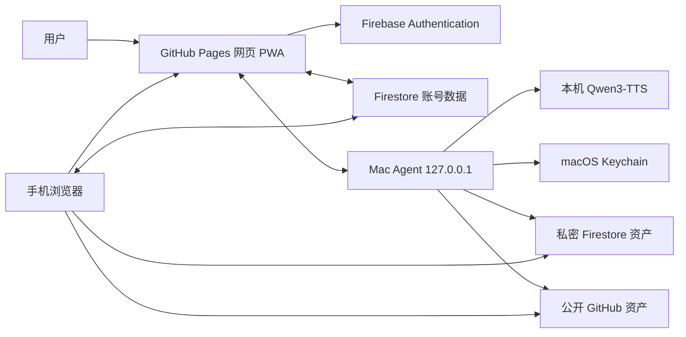
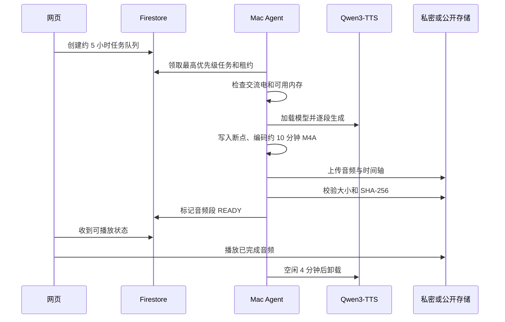
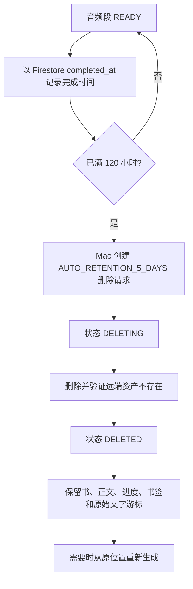

# 听见书页：免费跨设备听书工具项目完整说明

> 文档版本：1.0  
> 更新日期：2026-07-17  
> 项目状态：可运行、已部署；真实 iPhone Safari 最终验收待完成  
> 在线网页：<https://mkasumi1007.github.io/free-cross-device-audiobook/>  
> 代码仓库：<https://github.com/MKasumi1007/free-cross-device-audiobook>

## 1. 项目简介

“听见书页”是一个面向个人使用的免费跨设备听书工具。用户在 Mac 上导入 EPUB 或 TXT，使用自己的声音样本在本机生成语音，然后可以在网页中一边看正文、一边听音频，并在同一账号登录的手机上继续收听。

这个项目重点解决以下问题：

- 不习惯命令行，日常操作应全部在网页中完成。
- 书籍要显示真实章节和正文，而不是只生成一个大音频文件。
- 可以使用用户自己的声音和语气。
- 多本书可以同时留在书架，分别保存进度。
- 每次准备约 5 小时的可听内容，音频拆成约 10 分钟的小段。
- 生成音频满 5 天后自动删除，但书架、正文、书签和进度继续保留。
- 手机和 Mac 可以使用同一个网页，手机不承担语音生成。
- 不绑银行卡、不启用按量计费、不产生自动扣费。
- 不确定版权的书绝不公开，也不进入公开 GitHub 仓库。

## 2. 当前可以做什么

| 功能 | 当前状态 | 说明 |
| --- | --- | --- |
| EPUB 导入 | 已完成 | 支持 EPUB 2/3，按书内目录和正文结构提取章节 |
| TXT 导入 | 已完成 | 支持 UTF-8、UTF-16、GB18030，并推断中文章节标题 |
| 章节阅读 | 已完成 | 可选择章节、段落，显示正文并跟随播放位置高亮 |
| 自有声音 | 已完成 | Mac 本地选择 10-30 秒录音，填写对应文字，试听后确认 |
| 本地语音生成 | 已完成 | 使用 Qwen3-TTS，在 Mac 上单任务生成 |
| 五小时批次 | 已完成 | 网页一次安排约 5 小时，后台按约 10 分钟分段处理 |
| 多书书架 | 已完成 | 每本书独立保存章节、进度、书签和生成状态 |
| 手机播放 | 已实现并通过手机尺寸自动化测试 | 同账号可读取私密正文和已生成音频；真实 iPhone 仍需最终点播验收 |
| 断点续听 | 已完成 | 本地频繁保存，关键操作同步到云端，旧设备不能覆盖新进度 |
| 播放控制 | 已完成 | 播放、暂停、前后 15 秒、倍速、睡眠定时、书签、锁屏媒体控制 |
| 私密书籍 | 已完成 | 私密正文、时间轴和音频只存入账号隔离的 Firestore 文档 |
| 公开书籍 | 已完成 | 只有明确确认再分发权利后，才允许发布到公开 GitHub 资产 |
| 五天自动删除 | 已完成 | Mac 在线时每小时检查；满 120 小时后进入安全删除流程 |
| 手动音频管理 | 已完成 | 可按一段、一章、一本书或全部音频提前删除 |
| 重新生成 | 已完成 | 删除音频后保留原文字位置，可以从原位置重新生成 |
| 网页安装 | 已完成 | PWA 支持添加到桌面或手机主屏幕 |
| 免费保护 | 已完成 | 代码检查禁止付费能力，接近免费额度时暂停而不是升级 |

## 3. 最简单的使用方法

### 3.1 第一次使用

1. 在 Mac 上打开“听见书页”在线网页。
2. 点击登录，选择项目使用的 Google 账号。
3. 确认页面显示“Mac 已连接”。后台服务会随 Mac 登录自动启动，不需要打开终端。
4. 点击“添加书籍”，选择 EPUB 或 TXT。
5. 如果不能确定书籍的公开传播权，保持“私密”状态，不要勾选公开权利确认。
6. 打开“我的声音”，选择 10-30 秒清晰录音，并填写录音中实际说出的文字。
7. 点击试听，满意后点击“确认使用这个声音”。
8. 打开书籍，点击“私密生成约 5 小时音频”或“生成约 5 小时音频”。
9. 第一段变成可播放后即可开始收听，不必等满 5 小时全部生成完。

### 3.2 在手机上听

1. 手机打开同一个在线网页。
2. 使用与 Mac 相同的 Google 账号登录。
3. 从书架选择书籍和章节。
4. 已生成的音频可以直接播放；播放进度会同步。
5. 私密音频已经上传完成后，Mac 可以关机，手机仍可播放。
6. 尚未生成的内容需要等待 Mac 再次在线生成。

### 3.3 多本书的使用方式

- 多本书可以同时留在书架中，不需要反复导入。
- 每本书分别保存上次章节、段落和音频位置。
- 当前打开且可听缓存较少的书拥有更高生成优先级。
- 超过 48 小时没有打开的排队书籍会暂停补充，重新打开后恢复。
- 音频满 5 天会删除，书籍本身不会从书架消失。
- 以后重新打开已无音频的书，可以从保留的文字位置重新生成。

## 4. 产品边界

### 4.1 本项目明确支持

- Mac 导入 EPUB 和 TXT。
- 中文为主的长文本阅读与听书。
- Mac 本地 Qwen3-TTS 声音克隆。
- 浏览器书架、阅读器和播放器。
- Google 登录和同账号跨设备进度同步。
- 私密书籍的账号隔离存储。
- 用户明确拥有公开再分发权利时的公开存储。

### 4.2 当前不支持

- PDF、MOBI、AZW3、扫描图片书籍和带 DRM 的电子书。
- 在手机端导入书籍或生成声音。
- 完全在云端运行 Qwen 语音模型。
- 离开用户 Mac 后继续生成尚未生成的音频。
- 把不确定版权的书放到公开 GitHub。
- 付费 GPU、付费对象存储、Firebase Blaze 或任何自动扣费资源。
- 自动云备份原始 EPUB 和声音样本。

## 5. 总体架构



### 5.1 网页 PWA

网页使用 React、TypeScript 和 Vite 构建，部署在 GitHub Pages。它负责：

- 登录、书架、章节阅读和播放界面。
- 连接本机 Mac Agent。
- IndexedDB 本地缓存。
- Firestore 元数据、书签和进度同步。
- 私密正文与当前音频段的认证读取和校验。
- 生成任务、删除任务和重新生成任务的创建。
- PWA 安装、Service Worker 应用外壳缓存和手机适配。

Service Worker 只缓存网页程序，不缓存 EPUB、声音录音、正文、时间轴或 M4A，避免设备存储被整本音频占满。

### 5.2 Mac Agent

Mac Agent 是运行在 `127.0.0.1:17832` 的本地 FastAPI 服务，通过 LaunchAgent 随登录启动。它负责：

- 打开 macOS 原生文件选择器。
- 安全解析 EPUB/TXT。
- 保存本地书籍和声音样本。
- 与网页配对并领取当前账号的任务。
- 检查电源和可用内存。
- 启动、复用和卸载 Qwen 子进程。
- 按段生成 WAV，拼接并编码为 M4A。
- 生成段落时间轴和 SHA-256 校验值。
- 根据权利状态发布到私密或公开存储。
- 执行五天到期删除、用户手动删除、失败重试和资产对账。

网页不能向 Agent 提交任意文件路径。Agent 只接受原生选择器返回的文件，并限制允许访问它的网页 Origin。

### 5.3 Firebase

Firebase 只使用两个免费组件：

| 组件 | 用途 |
| --- | --- |
| Authentication | Google 用户登录、Mac Agent 匿名身份 |
| Firestore | 书架元数据、章节、进度、书签、任务、私密正文和私密音频 |

没有启用 Firebase Storage、Functions、Hosting、Analytics、Gemini、电话认证、Blaze 或 Cloud Billing。

### 5.4 GitHub

| GitHub 功能 | 用途 |
| --- | --- |
| Git 仓库 | 公开源代码、配置模板和项目文档 |
| GitHub Pages | 托管静态 PWA |
| GitHub Actions | 测试、构建和 Pages 部署 |
| `book-assets` 分支 | 仅保存已确认可公开书籍的压缩正文与时间轴 |
| GitHub Releases | 仅保存已确认可公开书籍的 M4A 音频 |

GitHub Actions 不承担生产语音生成。CPU 实测过慢，并且不能把 Actions 当作通用后台计算服务。

## 6. 书籍与隐私模式

每本书必须处于以下两种模式之一：

| 模式 | 适用情况 | 正文/时间轴 | 音频 | 是否公开 |
| --- | --- | --- | --- | --- |
| `LOCAL_ONLY` | 下载来源不明、版权不确定、仅供个人阅读 | 用户账号下的 Firestore 私密文档 | 用户账号下的 Firestore 私密文档 | 否 |
| `PUBLIC_RIGHTS_CONFIRMED` | 用户明确拥有公开传播或再分发权利 | GitHub `book-assets` 分支 | GitHub Releases | 是 |

默认模式是 `LOCAL_ONLY`。只有用户明确确认以下意思后，程序才允许公开发布：

> 我确认拥有公开传播或再分发这本书及生成音频的权利。

代码有多层防护：

1. 导入时默认私密。
2. 生成任务记录存储模式。
3. Mac Worker 根据书籍权利状态再次计算预期存储模式。
4. 生成管线拒绝权利状态与发布器不匹配的任务。
5. Firestore Rules 校验私密资产归属、书籍编号、类型和完成状态。
6. 仓库秘密扫描阻止书籍、令牌和凭据被误提交。

## 7. 私密资产如何保存

私密书籍不会获得公开 URL。压缩正文、时间轴和 M4A 被拆成小型 Firestore 文档：

- 每部分最多 512 KiB。
- 单个逻辑文件最多 32 MiB。
- 私密资产总量硬限制为 700 MiB。
- 每个逻辑文件保存 SHA-256。
- 上传状态先是 `UPLOADING`，全部完成后才变成 `READY`。
- 浏览器读取全部部分后重新拼接并验证大小和 SHA-256。
- 页面只为当前约 10 分钟音频建立临时 Blob URL，切换后立即释放。

原始 EPUB 不上传到 Firestore。为了让手机同时看正文，首次生成时会上传解析后的压缩正文；它仍然只允许同一个登录账号和已绑定的 Mac Agent 读取。

声音样本、声音文字、原始路径、归一化中间文件和声音哈希默认只留在 Mac，不上传到网页、GitHub 或 Firestore 私密资产区。

## 8. 语音生成流程



关键规则：

- 默认一次安排目标约 18,000 秒，即约 5 小时。
- 每个可播放块目标约 600 秒，即约 10 分钟。
- 尽量在自然段和章节边界切分。
- 逐段写入检查点，崩溃或重启后从未完成位置继续。
- 同一时间只有一个后台生成任务，避免 8GB 内存机器同时加载多个模型。
- 默认只在接通电源时生成。
- 可用内存少于 2 GiB 时暂停，不加载模型。
- 语音版本变化时旧任务暂停，避免一本书混入不同声音。
- 上传成功后删除本地 WAV、M4A 和时间轴临时文件。
- 生成工作空闲 4 分钟后卸载 Qwen 子进程。

## 9. 内存、速度与本地空间

### 9.1 待机

浏览书架、读正文、登录、同步和播放已生成音频时，不加载 Qwen。正式 Mac Agent 待机通常只占几十 MB 内存。

### 9.2 生成时

Qwen 生成会临时占用较多统一内存。基准机器为 8 GiB Apple Silicon Mac：

| 指标 | 已测结果 |
| --- | ---: |
| 模型加载 | 约 16 秒 |
| 7.68 秒测试音频生成 | 约 26.6 秒 |
| 生成实时系数 RTF | 约 3.47 |
| Qwen 进程峰值 RSS | 约 694 MiB |
| 系统峰值已用内存 | 约 5.52 GiB |
| 5 小时音频保守估计 | 约 17.3 小时生成时间 |

实际速度会受文本、温度、电源和其他程序影响。网页中的“生成约 5 小时”表示安排目标时长，不表示 5 小时内完成。

### 9.3 本地磁盘

- 原始书籍和声音样本留在用户的私密 Application Support 目录。
- 生成中间文件在成功发布后删除。
- 超过 24 小时的遗留临时音频会被本地清理任务删除。
- 检查点和发布记录会保留，用于断点恢复和幂等校验。
- 网页不会预缓存整本书的音频。

## 10. 五天音频保留策略

五天保留只针对生成的音频和对应时间轴，不删除书籍正文或阅读数据。



执行细节：

- Mac Agent 启动时检查，在线期间每小时检查一次。
- 以服务器写入的 `completed_at` 为准，不依赖网页打开时间。
- Mac 本地筛选时额外留 5 分钟时钟安全余量。
- Firestore Rules 独立要求至少 120 小时，提前自动删除会被拒绝。
- 每次最多安排 25 段，避免一次操作消耗过多免费写入额度。
- 删除使用已有的租约、代次和防迟到写入屏障。
- 私密资产删除所有 Firestore 分片并验证元数据不存在。
- 公开资产删除 Release M4A 和 `book-assets` 时间轴并验证结果。
- 删除过程中不加载 Qwen。
- Mac 在第五天关机时不会使用云端付费定时器；删除会延迟到 Mac 下次在线。
- 用户可以在五天前通过“音频空间”提前手动删除。

公开音频在可访问期间可能已被第三方复制。删除 GitHub 资产无法撤回第三方副本、缓存或历史下载。

## 11. 阅读进度与跨设备同步

进度包含：

- 书籍 ID。
- 章节 ID。
- 段落 ID 和段落顺序。
- 当前音频偏移秒数。
- 设备 ID。
- 单调递增版本号。
- 服务器更新时间。

网页播放时每隔数秒保存在本地 IndexedDB；暂停、跳章节、音频段结束等关键事件再同步到 Firestore。同步使用版本栅栏：如果旧设备提交的版本落后，云端返回新版本，旧设备不能覆盖较新的收听位置。

网络断开时可以继续阅读本地缓存并保存待同步进度；恢复网络后再尝试同步。私密音频没有被 Service Worker 全量缓存，因此离线播放只限浏览器当前已经加载的数据。

## 12. 安全设计

### 12.1 绝不进入 GitHub 的内容

- 账号密码、验证码、Cookie 和登录会话。
- Access Token、Refresh Token、Secret、私钥和个人访问令牌。
- macOS Keychain 内容。
- 未确认公开权利的书籍、解析正文、时间轴和生成音频。
- 真实声音样本、对应文字、原始路径和处理缓存。
- Qwen 模型缓存和本地运行数据。

### 12.2 可以公开的内容

- 源代码和项目文档。
- Firebase Web 公共客户端配置。
- 合成测试数据。
- 公版、开放许可或用户明确确认可再分发的书籍衍生资产。

Firebase Web 配置只能识别应用，不能代替账号授权。真正的访问控制由 Authentication 和 Firestore Security Rules 完成。

### 12.3 Mac 连接安全

- Agent 只监听 `127.0.0.1`，不对局域网开放。
- 使用精确 Origin 白名单。
- 文件选择和敏感操作使用短期一次性操作凭证。
- 自动配对失败时使用 6 位短期配对码。
- 配对码保存哈希，不保存明文。
- 配对码约 9 分钟过期，并限制尝试次数。
- Mac 刷新令牌只存入 macOS Keychain。
- 用户可以在网页中撤销 Mac，撤销后 Worker 不能读取新任务或私密资产。

### 12.4 任务安全

- 每次 Worker 领取任务都会获得租约和随机令牌。
- 租约有截止时间并定期续期。
- 迟到进程、旧尝试和旧删除代次不能发布结果。
- 上传、元数据写入和删除都进行哈希或存在性验证。
- 删除请求支持重复执行，404 视为已经删除，不会反复破坏数据。
- 对账只报告孤儿资产，不自动删除无法确定归属的内容。

## 13. 免费服务与硬限制

项目的原则不是“先免费试用”，而是“没有付款方式也能运行”。

| 服务 | 使用内容 | 付费保护 |
| --- | --- | --- |
| GitHub Pages | 静态网页 | 公共仓库标准 Pages，不启用付费功能 |
| GitHub Actions | CI 和部署 | 仅标准公共仓库 Runner，不使用 Larger Runner |
| GitHub Releases/分支 | 权利已确认的公开资产 | 不保存私密内容，不购买存储 |
| Firebase Spark | 登录、同步、私密资产 | 不绑定 Billing，超额时暂停而不是升级 |
| 用户 Mac | Qwen 语音计算 | 本地 CPU/内存，不租云 GPU |

当前 Firestore 免费配额设计依据：

- 存储 1 GiB。
- 每日 50,000 次读取。
- 每日 20,000 次写入。
- 每日 20,000 次删除。
- 每月 10 GiB 出站流量。

程序在估算达到 45,000 读取、18,000 写入或 18,000 删除时提前暂停云同步，次日 UTC 自动恢复资格。这个计数是本地保守估算，不是 Firebase 官方账单计数。

不得执行以下操作：

- 关联 Cloud Billing。
- 升级到 Blaze。
- 启用 Firebase Storage、Functions 或付费 TTL。
- 使用需要绑卡的云 GPU。
- 使用免费试用结束后自动收费的服务。
- 使用 GitHub Larger Runner。
- 为解决额度问题自动迁移到付费资源。

## 14. 核心数据结构

Firestore 主要路径如下：

```text
users/{ownerUid}
  devices/{deviceId}
  books/{bookId}
    chapters/{chapterId}
    bookmarks/{bookmarkId}
    audioChunks/{chunkId}
  progress/{bookId}
  generationRequests/{taskId}
  audioDeletionRequests/{requestId}
  privateAssets/{assetKey}
    parts/{partIndex}
  maintenance/audio-reconciliation

workerLinks/{workerUid}
pairingRequests/{pairingHash}
pairingAttempts/{ownerUid}
```

音频任务状态：

```text
QUEUED -> LEASED -> GENERATING -> ENCODING -> UPLOADING -> READY
                         |              |
                         +-> PAUSED     +-> FAILED_RETRYABLE

READY -> DELETING -> DELETED -> FAILED_RETRYABLE(重新生成) -> QUEUED
```

其他终止状态包括 `FAILED_FINAL` 和 `CANCELLED`。

## 15. 项目目录

```text
cloud-audiobook/
  apps/
    web/                         React/Vite PWA
      src/App.tsx                书架、阅读器和主要交互
      src/PlayerDock.tsx         播放器和媒体控制
      src/AudioManager.tsx       音频空间、删除与重建
      src/cloud.ts               Firestore 同步和私密资产读取
      src/storage.ts             IndexedDB 本地缓存
      e2e/                       Playwright 桌面/手机测试
    mac-agent/
      src/mac_agent/app.py       本地 HTTP API
      src/mac_agent/worker.py    后台任务调度
      src/mac_agent/generation.py 生成、编码和发布管线
      src/mac_agent/qwen_worker.py Qwen 子进程
      src/mac_agent/private_assets.py 私密 Firestore 分片存储
      src/mac_agent/task_cloud.py Firestore Worker 任务与保留策略
      src/mac_agent/voice.py     声音样本管理
      src/mac_agent/launchd.py   私密运行时和开机登录启动
  services/audiobook-core/       EPUB/TXT 解析、模型和规划
  packages/contracts/            TypeScript 数据契约
  packages/firebase-rules-tests/ Firestore Emulator 安全测试
  firebase/firestore.rules       线上访问控制
  scripts/                       安全扫描、免费审计和测试脚本
  docs/                          项目文档和阶段记录
  .github/workflows/             CI、Pages 和受限基准工作流
```

## 16. 本地开发

日常听书不需要这些命令。以下内容只供开发或修复。

### 16.1 环境要求

- macOS。
- Python 3.12 或 3.13。
- Node.js 20 以上，CI 当前使用 Node.js 22。
- Java 21，用于 Firestore Emulator 测试。
- FFmpeg，用于音频编码。
- 本地 Qwen3-TTS 环境和模型缓存。

### 16.2 安装依赖

```bash
python3 -m venv .venv
.venv/bin/pip install -e '.[dev]'
npm install
```

### 16.3 启动开发环境

```bash
.venv/bin/audiobook-mac-agent
npm run dev
```

开发网页地址：

```text
http://127.0.0.1:5173/free-cross-device-audiobook/
```

### 16.4 安装或修复正式后台服务

```bash
.venv/bin/audiobook-install-agent
```

安装器把运行时复制到用户的 Application Support 目录并写入私有 LaunchAgent。它不会把书籍、声音样本、令牌或音频复制到 Git 仓库。

## 17. 测试

### 17.1 完整测试

```bash
npm test
npm run test:e2e
npm run build
```

`npm test` 包含：

1. 免费能力审计。
2. Git 跟踪文件秘密扫描。
3. TypeScript 类型检查。
4. React 单元和组件测试。
5. Firestore Emulator 安全规则测试。
6. Python 单元与集成测试。

### 17.2 Python 质量检查

```bash
.venv/bin/ruff check services apps tests
.venv/bin/mypy services/audiobook-core/src apps/mac-agent/src
```

### 17.3 自动化覆盖重点

- EPUB/TXT 正常结构和恶意压缩包。
- 路径穿越、符号链接、Zip Bomb、DRM 和错误编码拒绝。
- 稳定章节/段落 ID。
- 登录、离线缓存和账号隔离。
- Mac 配对、撤销、过期和限速。
- 任务租约、恢复、检查点和迟到写入拒绝。
- 私密/公开存储模式强制分离。
- Firestore 私密分片大小、哈希和归属。
- 五天保留允许到期 Worker 删除并拒绝提前删除。
- 桌面和 Pixel 7 尺寸播放、切书、刷新续听和删除确认。
- Pages 生产构建和 Service Worker 不包含书籍媒体。

## 18. CI 与发布

推送到 `main` 后触发两套 GitHub Actions：

### 18.1 CI

- Python 编译安全脚本。
- 拒绝付费能力配置。
- 扫描跟踪文件中的凭据。
- 安装 Node、Python 和 Java。
- 审计生产 Web 依赖。
- 运行 Ruff、mypy、TypeScript、Web、Rules、Python 和 Playwright 测试。
- 构建 PWA。

### 18.2 GitHub Pages

- 安装锁定依赖。
- 构建 `apps/web/dist`。
- 上传静态产物。
- 发布到 GitHub Pages。

Firebase Security Rules 不随 Pages 自动部署。修改 Rules 后必须先通过 Emulator 测试，再使用 Firebase CLI 只部署 Firestore Rules/Indexes。不得顺手创建 Hosting、Storage 或 Functions。

## 19. 日常维护

### 19.1 查看服务是否正常

正常情况下网页会显示“Mac 已连接”。本地健康接口应返回：

```json
{
  "status": "ok",
  "service": "mac-agent",
  "tts": "not-loaded",
  "cloud": "configured"
}
```

`tts: not-loaded` 是正常待机状态，不是故障。

### 19.2 更新代码后的顺序

1. 拉取或检查最新代码。
2. 安装锁定依赖。
3. 运行完整测试和构建。
4. 更新 LaunchAgent 私密运行时。
5. 如果 Rules 有改动，先跑 Emulator，再部署 Rules。
6. 提交时只暂存本次代码和文档。
7. 再次运行秘密扫描。
8. 推送 GitHub 并确认 CI、Pages 都成功。

### 19.3 不应自动做的操作

- 删除无法确认归属的 GitHub 孤儿资产。
- 删除原始书籍、声音样本、书签或阅读进度。
- 公开 `LOCAL_ONLY` 书籍。
- 自动创建新 Firebase 项目。
- 自动启用 Billing 或付费资源。
- 把真实手机未测试的功能标记为已通过真实设备验收。

## 20. 常见问题

| 现象 | 原因 | 处理方式 |
| --- | --- | --- |
| 页面显示 Mac 未连接 | LaunchAgent 未运行、账号配对失效或 Origin 不匹配 | 先等待几秒；仍失败时重新安装 Agent 或重新配对 |
| 点击生成后一直等待 | Mac 关机、未接电源、可用内存不足、声音未确认 | 打开 Mac、接电源、关闭占内存程序并确认声音 |
| Qwen 占用内存 | 正在生成音频 | 生成停止后等待约 4 分钟，模型会自动卸载 |
| 手机只有书名没有正文 | 私密正文尚未在第一次生成时准备完成 | 等第一段任务开始并上传正文后刷新 |
| 手机无法播放下一段 | 该段尚未生成或网络断开 | 等 Mac 生成，或恢复网络后重试 |
| 音频五天后仍存在 | 第五天时 Mac 不在线 | 打开已配对 Mac，后台会在启动后检查并删除 |
| 音频被自动删除 | 已达到 120 小时保留期 | 书和进度仍在，可从音频空间重新生成 |
| 免费额度暂停 | 本地安全估算接近 Firestore 免费上限 | 等下一个 UTC 日自动恢复，不要升级套餐 |
| GitHub 403/429 | GitHub 限速 | 后台指数退避，最长等待数小时，不启用付费替代 |
| 私密空间接近上限 | 私密资产接近 700 MiB 硬限制 | 打开音频空间提前删除旧音频，或等待五天到期清理 |
| 书籍无法导入 | 格式不支持、加密、结构损坏或安全限制 | 转为无 DRM 的 EPUB/TXT；不要关闭安全检查 |

## 21. 已知限制和剩余验收

### 21.1 已知限制

- 私密 Firestore 适合个人短期音频缓存，不适合永久保存大量有声书。
- 五天删除依赖配对 Mac 在线，不是云端实时定时器。
- 8GB Mac 生成速度明显慢于实时播放速度，5 小时内容可能需要十几个小时。
- GitHub 公开资产适用于有明确权利的内容，不提供隐私。
- PWA 的后台行为受 iOS Safari 限制，不能保证网页关闭后持续执行任意任务。
- 浏览器离线缓存只覆盖应用外壳和少量当前数据，不覆盖全部音频。

### 21.2 尚待真实设备完成

自动化已经覆盖手机尺寸与浏览器行为，但以下项目仍必须在真实 iPhone 上确认：

- Safari 登录与私密正文读取。
- 私密 M4A 连续播放和章节切换。
- 锁屏播放、暂停和前后跳转。
- 来电、耳机断开或其他音频中断后的恢复。
- 添加到主屏幕后重新打开和续听。

在真实手机完成之前，项目状态应写为“手机功能已实现并通过模拟测试”，不能写成“真实 iPhone 全部验收通过”。

## 22. 验收清单

一次正式版本可以按以下清单验收：

- [ ] 公开仓库没有 EPUB、声音录音、真实生成音频或凭据。
- [ ] `npm test` 全部通过。
- [ ] `npm run test:e2e` 常规项目全部通过。
- [ ] `npm run build` 成功。
- [ ] Firebase Emulator Rules 测试通过。
- [ ] Firebase 项目仍为 Spark，未关联 Billing。
- [ ] Mac Agent 健康检查正常，待机时 Qwen 未加载。
- [ ] 私密合成测试资产可上传、下载、校验并删除。
- [ ] 未满五天的自动删除被 Rules 拒绝。
- [ ] 已满五天的自动删除可以进入两阶段删除流程。
- [ ] GitHub CI 成功。
- [ ] GitHub Pages 发布成功并加载最新代码。
- [ ] 真实 iPhone 完成登录、播放、锁屏和续听测试。

## 23. 相关文档

- [本地开发与操作说明](SETUP.md)
- [隐私、公开数据和版权边界](PRIVACY_AND_PUBLIC_DATA.md)
- [免费服务与额度审计](FREE_SERVICES.md)
- [性能基准](BENCHMARK.md)
- [阶段实施记录](STAGE_LOG.md)
- [第三方许可证](LICENSES.md)

## 24. 结论

本项目采用“网页负责阅读与控制、Mac 负责语音生成、Firebase 负责账号隔离同步、GitHub 负责公开代码和网页”的混合架构。在不绑卡和不使用付费云 GPU 的前提下，它可以让私密书籍在 Mac 生成后供手机收听，并保持章节、正文、书架和跨设备进度。

项目最重要的安全原则是：不确定版权的内容永远走 `LOCAL_ONLY`，声音样本永远优先留在 Mac，生成音频只保留五天，任何额度压力都通过暂停或删除解决，而不是自动升级付费服务。
